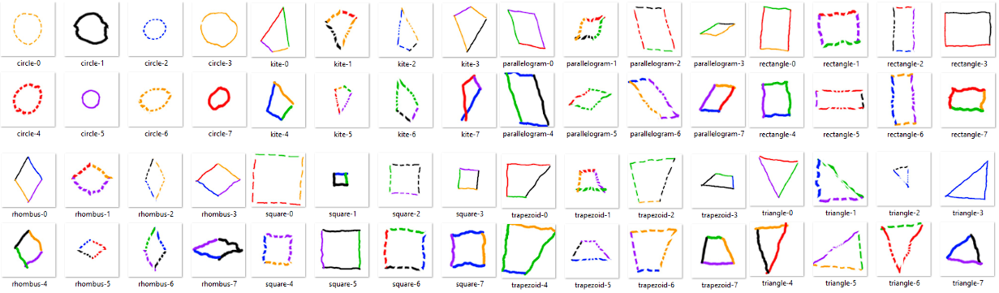

# FlatShapeNet

Dataset for the educational game [Ariga](ariga.profematika.com). The latest version supports hand-drawn plane shapes and data augmentation: rotation, horizontal-flip, vertical-flip and random erase (dash-line). Older versions can be accessed via the link: [github.com/reevald/MathEdu](https://github.com/reevald/MathEdu)

## Dataset
  
Download: [https://www.kaggle.com/datasets/geometric-shapes-mathematics](https://www.kaggle.com/datasets/geometric-shapes-mathematics)  
The dataset spans eight classes: circle, kite, parallelogram, rectangle, rhombus, square, trapezoid, triangle. The dataset consists of 20,000 images.

- Circle: Train(1,500); Val(500); Test(500)
- Kite: Train(1,500); Val(500); Test(500)
- Parallelogram: Train(1,500); Val(500); Test(500)
- Rectangle: Train(1,500); Val(500); Test(500)
- Rhombus: Train(1,500); Val(500); Test(500)
- Square: Train(1,500); Val(500); Test(500)
- Trapezoid: Train(1,500); Val(500); Test(500)
- Triangle: Train(1,500); Val(500); Test(500)

## Generate your own
### 1. Install requirements  
In order to run Processing.py from the command line. For maximum compatability with processing, you'll need to install Java 8 -- specifically, we recommend [JRE 8u202](https://www.oracle.com/java/technologies/javase/javase8-archive-downloads.html) from Oracle.  
After installing, ensure that you can run Java by typing the following on the command line:
```bash
$ java -version
```
You should see some output that looks like this:
```bash
java version "1.8.0_202"
Java(TM) SE Runtime Environment (build 1.8.0_202-b08)
Java HotSpot(TM) 64-Bit Server VM (build 25.202-b08, mixed mode)
```
More info about installation Processing: [https://py.processing.org/tutorials/command-line/](https://py.processing.org/tutorials/command-line/)
### 2. Clone repository  
```bash
$ git clone https://github.com/reevald/FlatShapeNet.git
$ cd FlatShapeNet/hand_drawn_shape
```
### 3. Generate Dataset
Run with default settings
```bash
$ java -jar lib/processing-py.jar hand_drawn_shape.pyde
```
[Optional] Run with custom variable
```bash
$ PATH_DEST=D:/ProcessingProject/Resource NUM_TRAIN=100 NUM_VAL=20 NUM_TEST=20 java -jar lib/processing-py.jar hand_drawn_shape.pyde
```
- `PATH_DEST` (default `current working directory`) option to specify the dataset path to be generated (destination path). 
- `NUM_TRAIN` (default `1500` images) option to number of train dataset
- `NUM_VAL` (default `500` images) option to number of validation dataset
- `NUM_TEST` (default `500` images) option to number of test dataset
## [Result] Directory structure
```
📂dataset   
└───📂train
│   └───📂circle
│   └───📂kite
│   └───📂parallelogram
│   └───📂rectangle
│   └───📂rhombus
│   └───📂square
│   └───📂trapezoid
│   └───📂triangle
└───📂val
│   └───📂circle
│   └───📂kite
│   └───📂parallelogram
│   └───📂rectangle
│   └───📂rhombus
│   └───📂square
│   └───📂trapezoid
│   └───📂triangle
└───📂test
    └───📂circle
    └───📂kite
    └───📂parallelogram
    └───📂rectangle
    └───📂rhombus
    └───📂square
    └───📂trapezoid
    └───📂triangle
```
## TODOs
- Add more custom variable
- Add more shapes
- Optimization of dataset generation speed
- Rewrite in native code (python or java)